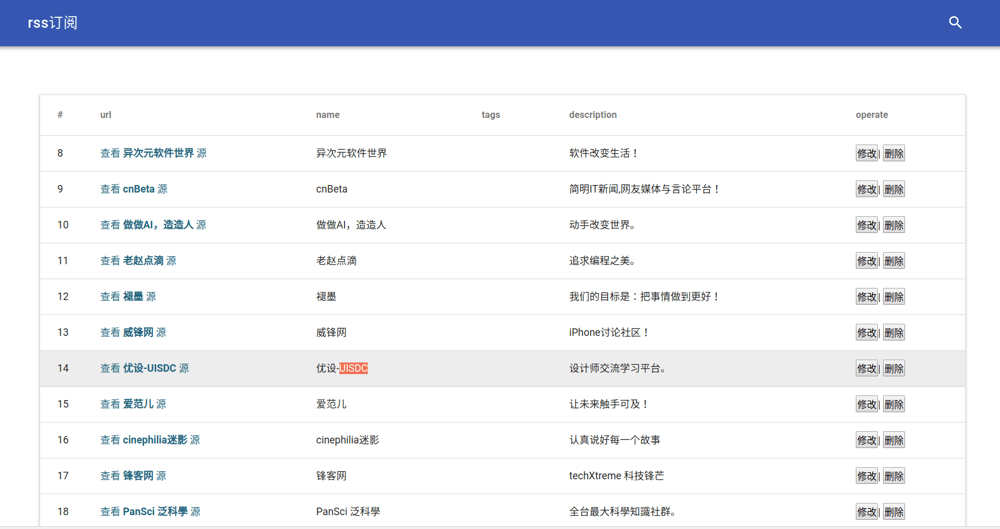
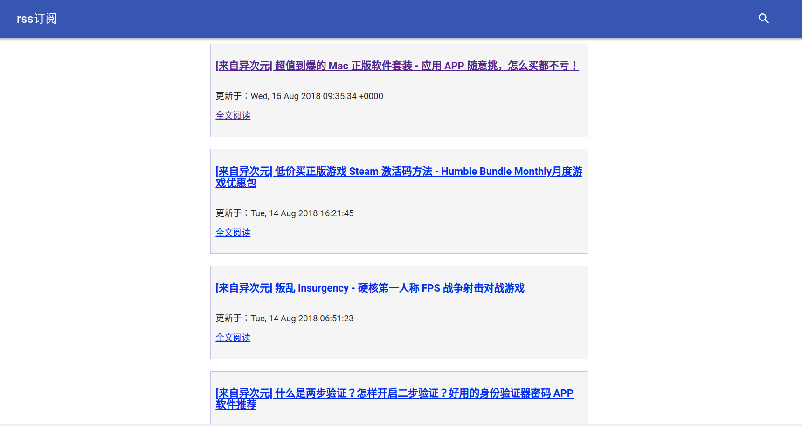

## rss_reader

RSS源阅读网站，优雅的个人的RSS聚合网站，基于Flask和MDUI编写

 - 演示地址: 174.137.52.6:8001
 - 安装文档： [deploy](./docs/项目部署流程.md)

### Useage

**安装**

``` shell
git clone https://github.com/hfstylite/rss_reader.git
cd rss_reader
pip install pipenv
# 基于Python3.6+
pipenv install 
cd rss_reader 
python app.py
```

### Features

- 自定义RSS源，个性化阅读
- 支持缓存
- MDUI设计，舒适的阅读体验

### Screenshots





### LICENSE
`rss_reader` is offered under the Apache 2 license.
